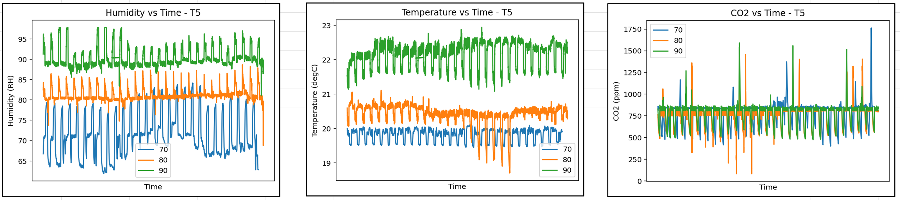
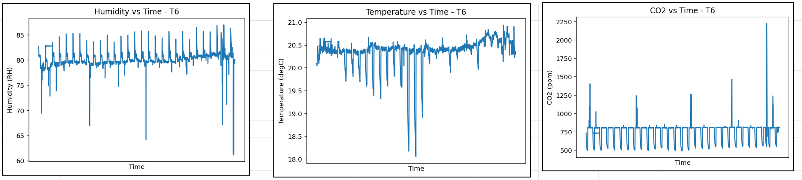

Several scripts that may prove helpful for processing data

# HCS_Plotting
Contains scripts for plotting environmental data exported from the HCS-1 and HCS-3 models utilized in the pilot plant growth chambers. Plots temperature (degC), humidity (RH), and CO2 (ppm).

growth_room_plotting.py: Plots data from all three growth chambers at once on the same graph.

single_growth_room_plot.py: Plots data from a single growth chamber.

# Light Spectral Quality
Plots and calculates lighting ratios from spectral data measured by PS-300 apogee spectroradiometer
